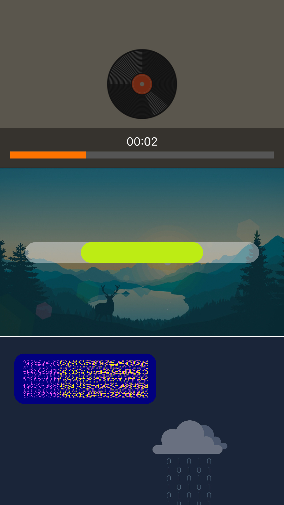
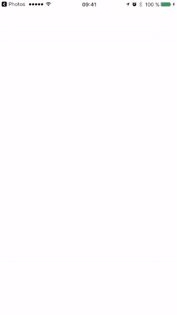

# ORBVisualTimer [](https://opensource.org/licenses/Zlib) 

ORBVisualTimer is a highly customizable timer view for iOS. Currently it only has Bar style implementation, but extendability was kept in mind. New styles are coming.

 

## Usage

### Create timer
Using `ORBVisualTimer` fabric:
```objective-c
/* Required minimum */
ORBVisualTimerBar *barTimer = (ORBVisualTimerBar *)[ORBVisualTimer timerWithStyle:ORBVisualTimerStyleBar frame:myFrame timeRemaining:8.0f];
barTimer.delegate = self;
```
Or using `ORBVisualTimerBar` initializer:
```objective-c
ORBVisualTimerBar *barTimer = [[ORBVisualTimerBar alloc] initWithBarAnimationStyle:ORBVisualTimerBarAnimationStyleReflection frame:myFrame timeRemaining:10.0f];
barTimer.delegate = self;
```

### Customize
All properties have default values, so this step is optional.
```objective-c
barTimer.barAnimationStyle = ORBVisualTimerBarAnimationStyleStraight;
barTimer.backgroundViewColor = [UIColor darkGrayColor];
barTimer.backgroundViewCornerRadius = 20.0f;
barTimer.timerShapeInactiveColor = [UIColor lightGrayColor];
barTimer.timerLabelColor = [UIColor orangeColor];
barTimer.showTimerLabel = YES;
barTimer.autohideWhenFired = NO;
barTimer.barCapStyle = kCALineCapSquare;
barTimer.barThickness = 100.0f;
barTimer.barPadding = 60.0f;
```

### Run
```objective-c
[self.view addSubview:barTimer];
[barTimer start];
```

### Stop and Hide
```objective-c
[barTimer stopTimerView];
```
##### or
```objective-c
[barTimer stopAndHide];
```

<hr>

### Using Delegate
Delegate method delivers event when timer is fired.
```objective-c
- (void)visualTimerFired:(ORBVisualTimer *)timerView {
    NSLog(@"FIRED!");
}
```

### Key-Value Observing
You can use **readonly** property `timeRemaining` to track every second of timer activity and handle every state.

##### Subscribe to `timeRemaining` property changes:
```objective-c
[barTimer addObserver:self forKeyPath:@"timeRemaining"
                  options:(NSKeyValueObservingOptionNew|NSKeyValueObservingOptionOld) context:nil];
```
##### Add observer callback to handle new values:
```objective-c
- (void)observeValueForKeyPath:(NSString *)keyPath ofObject:(id)object change:(NSDictionary<NSKeyValueChangeKey,id> *)change context:(void *)context {
    
    /* Check out Demo for more examples */
    
    ORBVisualTimerBar *bar = (ORBVisualTimerBar *)object;
    
    if ([keyPath isEqualToString:@"timeRemaining"] && [bar timerIsActive]) {
        CGFloat timeRemaining = [[change valueForKey:NSKeyValueChangeNewKey] doubleValue];
        NSLog(@"Time remaining: %.1f", timeRemaining);
        
        CGFloat hue = ( arc4random() % 256 / 256.0 );
        CGFloat saturation = ( arc4random() % 128 / 256.0 ) + 0.5;
        CGFloat brightness = ( arc4random() % 128 / 256.0 ) + 0.5;
        
        UIColor *color = [UIColor colorWithHue:hue
                                    saturation:saturation
                                    brightness:brightness alpha:1];
                                    
        bar.timerShapeActiveColor = color;
        
        if (timeRemaining <= 0) {
          bar.barThickness -= 30.0f;
          bar.barPadding += 60.0f;
        }
    }
}
```

## Properties and Methods Reference
### `ORBVisualTimer` Class
```objective-c
#pragma mark - Properties

/**
 Style of the timer to construct. In v1.0 only ORBVisualTimerStyleBar is implemented.
 */
@property (nonatomic, assign, readonly) ORBVisualTimerStyle style;

/**
 Delegate object to receive events from timer.
 */
@property (nonatomic, weak) id <ORBVisualTimerDelegate> delegate;

/**
 Use this readonly property to track currently remaining time.
 */
@property (nonatomic, assign, readonly) NSTimeInterval timeRemaining;

/**
 Indicates if timer is currently running or stopped.
 */
@property (nonatomic, assign, readonly) BOOL timerIsActive;

/* --- CUSTOMIZATION --- */

/**
 Color of the containing view around timer itself. Default value is black color.
 */
@property (nonatomic, strong) UIColor *backgroundViewColor;

/**
 Corner radius for containing view around timer. Default value is 0.0f.
 */
@property (nonatomic, assign) CGFloat backgroundViewCornerRadius;

/**
 Color of the timer shape's (bar, circle, etc) background component, which stays inactive all the time. Default value is light gray color.
 */
@property (nonatomic, strong) UIColor *timerShapeInactiveColor;

/**
 Color of the timer shape's (bar, circle, etc) foreground component, which is animated according to time remaining. Default value is green color.
 */
@property (nonatomic, strong) UIColor *timerShapeActiveColor;

/**
 Whether or not to show label with time remaining. Default value is YES;
 */
@property (nonatomic, assign) BOOL showTimerLabel;

/**
 Color of the timer label text. Default value is white color.
 */
@property (nonatomic, strong) UIColor *timerLabelColor;


/**
 Whether or not to hide timer view after firing. Default value is NO.
 */
@property (nonatomic, assign) BOOL autohideWhenFired;

#pragma mark - Methods

/**
 \brief Constructs timer view with given style.
 \param style Style of the timer.
 \param frame Frame of the view.
 \param timeRemaining Time to initialize timer with.
 \returns Timer object of correspondent class.
 */
+ (instancetype)timerWithStyle:(ORBVisualTimerStyle)style
                       frame:(CGRect)frame
               timeRemaining:(NSTimeInterval)timeRemaining;

/**
 \brief Starts the timer.
 */
- (void)start;

/**
 \brief Stops the timer and resets time setting.
 */
- (void)stopTimerView;

/**
 \brief Stops the timer and hides its view.
 */
- (void)stopAndHide;
```

### `ORBVisualTimerBar` Class
```objective-c
#pragma mark - Properties

/**
 Style of bar timer animation. Default value is ORBVisualTimerBarAnimationStyleStraight.
 */
@property (nonatomic, assign) ORBVisualTimerBarAnimationStyle barAnimationStyle;

/**
 Thikness of bar. Default value is 5.0f.
 */
@property (nonatomic, assign) CGFloat barThickness;

/**
 Horizontal padding for both left and right bar ends. Default value is 10.0f;
 */
@property (nonatomic, assign) CGFloat barPadding;

/**
 Cap style for both bar ends. Default value is kCALineCapRound.
 \discussion Possible pre-defined values include kCALineCapButt, kCALineCapRound and kCALineCapSquare.
 */
@property (nonatomic, assign) NSString *barCapStyle;

#pragma mark - Methods

/**
 \brief Initializes bar timer with given style.
 \param barAnimationStyle Style of bar animation.
 \param frame Frame of the view.
 \param timeRemaining Time to initialize timer with.
 */
- (instancetype)initWithBarAnimationStyle:(ORBVisualTimerBarAnimationStyle)barAnimationStyle
                                    frame:(CGRect)frame
                            timeRemaining:(NSTimeInterval)timeRemaining;
```

## ToDo's
+ Extend with other timer styles;

## License
ORBVisualTimer is released under the permissive zlib License. See the [LICENSE](https://raw.githubusercontent.com/0xNSHuman/ORBVisualTimer/master/LICENSE.md) file.
